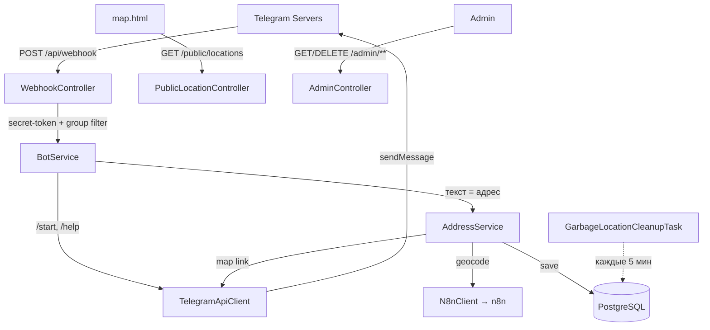

<div align="center">

# 🗺️ TgBotMap

**Telegram-бот для сбора и отображения точек (свалок) на карте**

Принимает адреса из Telegram-группы, геокодирует их и показывает на Яндекс.Карте.

[](https://openjdk.org/projects/jdk/21/)
[](https://spring.io/projects/spring-boot)
[](https://www.postgresql.org/)
[](https://docs.docker.com/compose/)
[](https://github.com/willaaaaayy/tggarbagebot/releases/tag/v0.2.0)
[](https://github.com/willaaaaayy/tggarbagebot/actions/workflows/ci.yml)

</div>

---

## 📖 О проекте

**TgBotMap** — это webhook-бот на Spring Boot. Пользователи отправляют в Telegram-группу адрес
свалки обычным текстовым сообщением — бот определяет координаты через сервис геокодирования
([n8n](https://n8n.io/)), сохраняет точку в PostgreSQL и отвечает ссылкой на Яндекс.Карты.
Все точки отображаются на публичной HTML-карте и доступны через защищённое админ-API.
Записи автоматически удаляются спустя 3 часа.

## ✨ Возможности

- 📍 **Сбор адресов** — любое текстовое сообщение из разрешённой группы трактуется как адрес.
- 🌐 **Геокодирование** через n8n-вебхук с ретраями и таймаутами.
- 🗺️ **Яндекс.Карты** — ссылка на точку/маршрут в ответе + интерактивная карта `/public/map`.
- 🔐 **Безопасность** — проверка `X-Telegram-Bot-Api-Secret-Token`, фильтр по группе, Basic-auth для админки.
- 🧹 **Автоочистка** — записи старше 3 часов удаляются по расписанию (каждые 5 минут).
- 👤 **Учёт пользователей** — идемпотентная регистрация (`/start`, `/help`).
- 🐳 **Docker Compose** — app + PostgreSQL + n8n из коробки.

## 🏗️ Архитектура



## 🧰 Технологии

| Слой              | Технология                                  |
|-------------------|---------------------------------------------|
| Язык / рантайм    | Java 21                                      |
| Фреймворк         | Spring Boot 3.2.5 (Web, Security, Validation, Actuator) |
| HTTP-клиент       | Spring WebClient (Reactor Netty)             |
| БД / ORM          | PostgreSQL 16, Spring Data JPA, Hibernate    |
| Миграции          | Flyway                                       |
| Шаблоны           | Thymeleaf + Yandex Maps JS API               |
| Геокодирование    | n8n (внешний вебхук)                          |
| Сборка / деплой   | Maven, Docker (multi-stage), Docker Compose  |

## 🚀 Быстрый старт

### Вариант 1 — Docker Compose (рекомендуется)

```bash
cp .env.example .env
# отредактируйте .env: BOT_TOKEN, ADMIN_PASSWORD, DB_PASSWORD, n8n-креды и т.д.

docker compose up -d --build
```

Поднимутся три сервиса: `bot` (:8080), `postgres` (:5432), `n8n` (:5678).

### Вариант 2 — локально

```bash
# нужен запущенный PostgreSQL (или docker compose up -d postgres)
export SPRING_PROFILES_ACTIVE=dev
./mvnw spring-boot:run
```

### Регистрация вебхука

Бот сам зарегистрирует вебхук при старте, если задан `TELEGRAM_WEBHOOK_URL`
(должен быть публично доступным HTTPS-адресом, оканчивающимся на `TELEGRAM_WEBHOOK_PATH`).
Если задан `TELEGRAM_WEBHOOK_SECRET`, он регистрируется как `secret_token` и проверяется на каждом апдейте.

## ⚙️ Конфигурация

Все параметры задаются через переменные окружения (см. `.env.example`).

| Переменная                 | Назначение                                              | По умолчанию              |
|----------------------------|---------------------------------------------------------|---------------------------|
| `BOT_TOKEN`                | Токен Telegram-бота **(обязателен)**                    | —                         |
| `TELEGRAM_ALLOWED_GROUP_ID`| ID разрешённой группы (пусто = принимать любые чаты)    | —                         |
| `TELEGRAM_WEBHOOK_PATH`    | Путь вебхука                                            | `/api/webhook`            |
| `TELEGRAM_WEBHOOK_URL`     | Публичный URL для регистрации вебхука                   | —                         |
| `TELEGRAM_WEBHOOK_SECRET`  | Секрет для проверки заголовка апдейтов (опционально)    | —                         |
| `N8N_URL`                  | Базовый URL сервиса геокодирования                      | `http://localhost:5678`   |
| `ADMIN_USERNAME`           | Логин админ-API                                         | `admin`                   |
| `ADMIN_PASSWORD`           | Пароль админ-API **(обязателен в prod)**                | — (dev: `dev-secret`)     |
| `DB_HOST` / `DB_PORT`      | Хост/порт PostgreSQL                                    | `localhost` / `5432`      |
| `DB_NAME` / `DB_USERNAME` / `DB_PASSWORD` | Параметры подключения к БД               | `tgbotmap` / …            |
| `SPRING_PROFILES_ACTIVE`   | Профиль (`dev` / `prod`)                                | `prod`                    |

## 🔌 Эндпоинты

| Метод    | Путь                       | Доступ        | Описание                                  |
|----------|----------------------------|---------------|-------------------------------------------|
| `POST`   | `/api/webhook`             | Telegram      | Приём апдейтов (secret-token + фильтр группы) |
| `GET`    | `/public/locations`        | Публичный     | Список точек (JSON) для карты              |
| `GET`    | `/public/map`              | Публичный     | Интерактивная Яндекс.Карта (HTML)          |
| `GET`    | `/admin/locations`         | Basic-auth    | Все точки (JSON)                           |
| `GET`    | `/admin/map`               | Basic-auth    | Ссылка на Яндекс.Карты со всеми точками    |
| `DELETE` | `/admin/locations/{id}`    | Basic-auth    | Удалить точку                              |
| `GET`    | `/actuator/health`         | Публичный     | Health-check                               |

## 💬 Команды бота

| Команда            | Действие                                       |
|--------------------|------------------------------------------------|
| `/start`           | Регистрация пользователя и приветствие         |
| `/help`            | Справка по командам                            |
| `<текст-адрес>`    | Геокодировать адрес и добавить точку на карту  |

## 🌍 Контракт геокодирования (n8n)

`N8nClient` отправляет `POST {N8N_URL}/webhook/geocode`:

```json
// Запрос
{ "address": "ул. Ленина, 1" }

// Ожидаемый ответ
{ "lat": 55.751244, "lon": 37.618423 }
```

Реализуйте соответствующий workflow в n8n (например, через Яндекс/Nominatim Geocoder).

## 🗂️ Структура проекта

```
src/main/java/com/tgbotmap/
├── controller/   # WebhookController, AdminController, PublicLocationController, MapController
├── service/      # BotService, AddressService, UserService, MapLinkService, WebhookRegistrationService
├── client/       # N8nClient (геокодирование)
├── integration/  # TelegramApiClient
├── scheduler/    # GarbageLocationCleanupTask
├── config/       # SecurityConfig, WebClientConfig, TelegramBotProperties
├── entity/       # BotUser, GarbageLocation
├── repository/   # BotUserRepository, GarbageLocationRepository
├── model/telegram/  # POJO Telegram API
├── dto/          # GarbageLocationDto
└── exception/    # Geocoding*Exception
src/main/resources/
├── db/migration/ # Flyway: V1 (bot_users), V2 (garbage_locations)
├── templates/    # map.html
└── application*.yml
```

## 🧪 Тесты

```bash
./mvnw -Dtest='MapLinkServiceTest,AddressServiceTest,BotServiceTest,WebhookControllerTest' test
```

Unit-тесты не требуют БД. Тест `TgBotMapApplicationTests.contextLoads` поднимает полный контекст
и требует доступной PostgreSQL (профиль `dev`).

## 🔒 Безопасность

- Задайте **`TELEGRAM_WEBHOOK_SECRET`** в prod, чтобы отклонять поддельные апдейты.
- Смените **`ADMIN_PASSWORD`** — в prod пустой пароль приводит к ошибке старта (fail-fast).
- В `map.html` укажите свой ключ в `apikey=YOUR_API_KEY` для Yandex Maps JS API.
- `.env` не коммитится (см. `.gitignore`); используйте `.env.example` как шаблон.

## 📝 Changelog

### [v0.2.0](https://github.com/willaaaaayy/tggarbagebot/releases/tag/v0.2.0)

- 📍 Реализован основной конвейер: текст-адрес → геокодирование (n8n) → сохранение → ответ со ссылкой на карту.
- 🔐 Единый `WebhookController` с проверкой `X-Telegram-Bot-Api-Secret-Token` и фильтром по группе.
- 🌐 Публичный read-only эндпоинт `GET /public/locations`; убраны хардкод-креды из `map.html`.
- 🛡️ Удалён дефолтный пароль `admin/admin` (fail-fast в prod); исправлен синтаксис плейсхолдеров.
- 🧹 Удалён мёртвый код (`TelegramWebhookController`, `TelegramSenderService`, `dto/telegram/*`).
- 🧪 Добавлены unit-тесты и 📖 README.

Полный список изменений и заметки по деплою — на [странице релиза](https://github.com/willaaaaayy/tggarbagebot/releases/tag/v0.2.0).

---

<div align="center">
<sub>Сделано на Spring Boot 3 · Java 21</sub>
</div>
