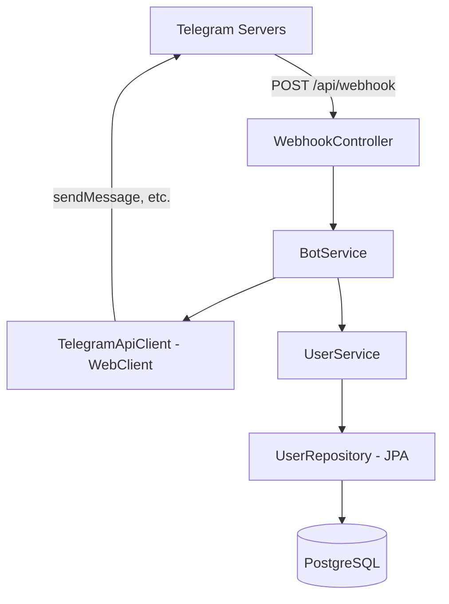
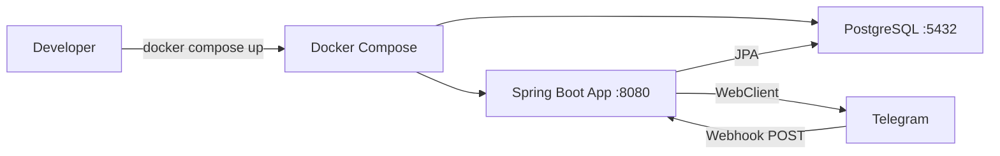

# TgBotMap — Production-Ready Spring Boot 3.2 Project Plan

## Architecture Overview



## Package Structure

```
src/main/java/com/tgbotmap/
├── TgBotMapApplication.java
├── config/
│   └── WebClientConfig.java
├── controller/
│   └── WebhookController.java
├── service/
│   ├── BotService.java
│   └── UserService.java
├── repository/
│   └── BotUserRepository.java
├── entity/
│   └── BotUser.java
├── integration/
│   └── TelegramApiClient.java
└── model/
    └── telegram/
        ├── Update.java
        ├── Message.java
        ├── Chat.java
        ├── SendMessageRequest.java
        └── TelegramResponse.java

src/main/resources/
├── application.yml
├── application-dev.yml
├── application-prod.yml
└── logback-spring.xml

src/test/java/com/tgbotmap/
└── TgBotMapApplicationTests.java
```

## File-by-File Plan

### 1. `pom.xml`
- Parent: `spring-boot-starter-parent:3.2.5`
- Java 21
- Dependencies:
  - `spring-boot-starter-web`
  - `spring-boot-starter-data-jpa`
  - `spring-boot-starter-webflux` — for WebClient
  - `spring-boot-starter-validation`
  - `spring-boot-starter-actuator`
  - `postgresql` runtime
  - `lombok` compile-only
  - `spring-boot-starter-test` test
  - `spring-boot-docker-compose` optional dev support
- Plugins: `spring-boot-maven-plugin`

### 2. `TgBotMapApplication.java`
- Standard `@SpringBootApplication` main class

### 3. `config/WebClientConfig.java`
- `@Configuration` bean producing `WebClient` pre-configured with Telegram API base URL `https://api.telegram.org/bot{token}`
- Configurable timeouts via properties

### 4. `controller/WebhookController.java`
- `@RestController`
- `POST /api/webhook` — receives Telegram `Update` JSON
- Delegates to `BotService`
- Returns 200 OK immediately for stateless processing

### 5. `service/BotService.java`
- Core command routing logic
- Handles `/start` command — registers user via `UserService`, sends welcome message via `TelegramApiClient`
- Extensible for future commands

### 6. `service/UserService.java`
- CRUD operations on `BotUser`
- `registerOrGet(chatId, username)` — idempotent user registration

### 7. `repository/BotUserRepository.java`
- `JpaRepository<BotUser, Long>`
- `Optional<BotUser> findByChatId(Long chatId)`

### 8. `entity/BotUser.java`
- `@Entity` with Lombok `@Data`, `@Builder`, `@NoArgsConstructor`, `@AllArgsConstructor`
- Fields: `id` (UUID, generated), `chatId` (unique), `username`, `firstName`, `lastName`, `createdAt`, `updatedAt`
- `@PrePersist` / `@PreUpdate` for timestamps

### 9. `integration/TelegramApiClient.java`
- `@Component` using injected `WebClient`
- `sendMessage(Long chatId, String text)` — POST to Telegram `sendMessage` endpoint
- Returns `Mono<TelegramResponse>` but blocks or subscribes as needed

### 10. `model/telegram/*.java`
- POJOs with Lombok `@Data` and Jackson `@JsonProperty` for snake_case mapping
- `Update`: updateId, message
- `Message`: messageId, chat, text, from
- `Chat`: id, firstName, lastName, username, type
- `SendMessageRequest`: chatId, text, parseMode
- `TelegramResponse`: ok, result

### 11. `application.yml`
- Common config: server port 8080, JPA ddl-auto, Jackson snake_case
- Telegram bot token and webhook path as env vars with defaults

### 12. `application-dev.yml`
- PostgreSQL localhost:5432
- ddl-auto: update
- Debug logging

### 13. `application-prod.yml`
- PostgreSQL from env vars
- ddl-auto: validate
- Info logging
- Actuator health endpoint only

### 14. `logback-spring.xml`
- Console appender with pattern
- Profile-specific log levels: DEBUG for dev, INFO for prod
- Async appender for prod

### 15. `Dockerfile`
- Multi-stage build:
  - Stage 1: Maven build with Eclipse Temurin 21
  - Stage 2: Runtime with Eclipse Temurin 21 JRE
- Non-root user
- Health check via actuator

### 16. `docker-compose.yml`
- Services: `app`, `postgres`
- PostgreSQL 16 with volume
- App depends_on postgres with healthcheck
- Environment variables from `.env`
- Network isolation

### 17. `.env.example`
- Template for required environment variables

### 18. Update `.gitignore`
- Add `.env` to gitignore

### 19. `TgBotMapApplicationTests.java`
- Basic context load test placeholder

## Key Design Decisions

| Decision | Rationale |
|----------|-----------|
| Webhook over polling | Stateless, scalable, production-grade |
| WebClient over RestTemplate | Non-blocking, modern, RestTemplate deprecated |
| UUID primary keys | Avoids sequential ID guessing, better for distributed systems |
| Env vars for secrets | 12-factor app compliance, no secrets in code |
| Multi-stage Docker build | Smaller image, faster deploys |
| Actuator | Health checks for orchestrators like K8s |
| Stateless design | No session state — horizontal scaling ready |

## Deployment Flow


